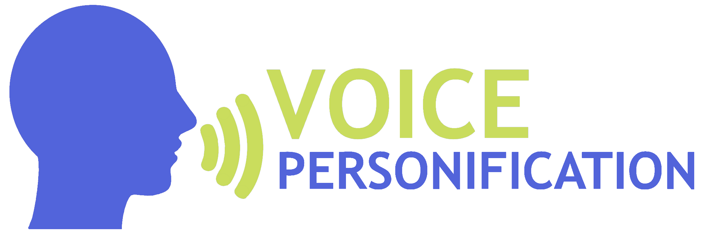

[](https://git.io/typing-svg)


---

## 🚀 Описание проекта

**Voice Personification** — это отдельный модуль для распознавания пользователя по голосу, ориентированный на интеграцию в LLM, чат-боты, образовательные платформы и другие ИИ-сервисы.  
Наша система поддерживает короткие аудио (от 2 секунд), сложные акустические условия и многопользовательские сценарии.

---

## 🔧 Основные возможности

- 🔒 Биометрическая верификация личности по голосу
- ⚡ Работа с короткими фрагментами речи (2–5 секунд)
- 🌍 Устойчивость к шуму, реверберации и разным языкам
- 🧠 Предобученные модели на основе совремемнных архитектур: wav2vec-BERT, Whisper, Next-TDNN
- 🎙️ Поддержка сегментации речи
- 🧩 Готова к интеграции с LLM, чат-ботами, образовательными системами

---


## ⚙️ Установка


### 1. Клонируйте репозиторий

```bash
git clone git@github.com:SpeakerRecognizer/VoicePersonification.git
cd VoicePersonification
```

> ⚠️ Если у вас не установлен `git`, установите его с [официального сайта](https://git-scm.com/downloads)  
> ⚠️ Если вы не настроили SSH-ключ для GitHub, [вот инструкция](https://docs.github.com/en/authentication/connecting-to-github-with-ssh/about-ssh)


### 2. Создайте окружение

```bash
conda create --prefix ./envs/python3.8 python=3.8 pip
```

> ⚠️ Если у вас не установлена `conda`, установите ее с [официального сайта Miniconda](https://docs.conda.io/en/latest/miniconda.html)  
> ⚡ Альтернатива: [Mamba](https://mamba.readthedocs.io/en/latest/)

Затем активируйте окружение:

```bash
conda activate ./envs/python3.8
```


### 3. Установите PyTorch

```bash
conda install pytorch==2.2.2 torchvision==0.17.2 torchaudio==2.2.2 pytorch-cuda=12.1 -c pytorch -c nvidia
```


### 4. Установите остальные зависимости

```bash
python3 -m pip install -r requirements/requirements.dev.txt
```


### ✅ Готово!

Теперь проект готов к использованию 🚀


---

## 🏃 Быстрый старт

### 📥 Загрузка и подготовка данных

Скачайте и подготовьте датасет VoxCeleb1:

```bash
bash scripts/download_and_preprocess_data.sh data/download_data data/raw_data data/scp data/protocols
```
После выполнения скрипта вы получите:
- `data/download_data/` — архивы и протоколы
- `data/raw_data/` — распакованные аудио
- `data/scp/` — файлы `wav.scp` и `utt2spk`
- `data/protocols/` — протоколы для тестов

### 🧪 Тестирование моделей
Запустите тест на подготовленных данных:

```bash
# Подготовка разметки детектором речи

export CUDA_VISIBLE_DEVICES=0; 
export HF_TOKEN_BROUHAHA="YOUR HUGGINGFACE_TOKEN"; # Токен доступа для модели brouhaha, ниже описано как его получить
python -m VoicePersonification.main \
    -cp=../experiments/brouhaha_vad \
    -cn=predict

# Верификация диктора по протоколу

python -m VoicePersonification.main \
  -cp=../experiments/ecapa-tdnn \
  -cn=test
```

> Для получения доступа к модели brouhaha (HF_TOKEN_BROUHAHA), необходимо авторизироваться на HuggingFace и перейти на [страницу](https://huggingface.co/pyannote/brouhaha). Заполнить поля ("Company/university", "Website", "I plan to use this model for (task, type of audio data, etc)"), после чего в личном кабинете появится access token.

> Вместо `ecapa-tdnn` укажите нужную модель:  
> `experiments/itmo_personification_model_large`, `experiments/itmo_personification_model_fast`, `experiments/itmo_personification_model_segmentation`, и т.д.
---
В результаты работы скрипта будет выведено качество работы алгоритма на выбранном датасете (EER, порог EER):

```bash
────────────────────────────────────────────────
       Test metric             DataLoader 0
────────────────────────────────────────────────
           EER                    1.27
           Thr                    0.31
────────────────────────────────────────────────
```

## 🧠 Наши модели

| Название модели                        | Особенности                                                                          | Архитектура    | Размер |
|----------------------------------------|---------------------------------------------------------------------------------------|----------------|----------|
| `itmo_personification_model_large`  | Основная модель с высокой точностью и устойчивостью; использует SSL-предобучение     | wav2vec-BERT   |  203        |
| `itmo_personification_model_fast`      | Лёгкая и быстрая модель для верификации                        | Next-TDNN      |       17.1   |
| `itmo_personification_model_segmentation` | Позволяет точно выделять участки речи отдельных говорящих для улучшения верификации | Whisper        |     24.9     |
| `ecapa-tdnn baseline`                  | Бейзлайн-модель для сравнения  | ECAPA-TDNN     |   22.2       |

---

## 📊 Сравнение 

Сравнение проводилось по метрике **EER (Equal Error Rate, %)**
| Модель                                      | VoxCeleb1 | Voices | NIST SRE 2016 | NIST SRE 2019 |
|--------------------------------------------|-----------|--------|----------------|----------------|
| `itmo personification model large`      | 0.71     | 4.36  | 10.23          | 9.35          |
| `itmo personification model fast`          | 5.42     | 9.75  | 1.72          | 5.86          |
| `itmo personification model segmentation`                       | 3.56     | 6.09  | 19.07          | 16.33          |
| `ecapa-tdnn baseline` | 1.27        | 6.74     | 18.77             | 16.12            |

---

## 📒 Туториалы и примеры

- [`notebooks/verification-tutorial.ipynb`](https://github.com/SpeakerRecognizer/VoicePersonification/blob/main/notebooks/verification-tutorial.ipynb) — быстрый старт и простая верификация на двух примерах
- [`examples/`](examples/) — примеры enrollment и test аудиофайлов
- [`grpcio-services`](services/examples/README.md) - Запуск сервисов
- [`demo examination`](demo/examination/README.md) - Демонстрация проведения экзамена 
---

## 🎓 Курс по распознаванию диктора

Если вам интересно, как работает голосовая биометрия изнутри — загляните в репозиторий нашего [курса](https://github.com/itmo-mbss-lab/sr_labs_book/tree/main)!  
Там мы рассказываем, как строятся системы распознавания дикторов, как оценивается их качество, и как они применяются в реальных сценариях.  
Все задания, материалы и код доступны в репозитории по ссылке выше.

> 💡 Курс читается в рамках магистерской программы «Речевые технологии и машинное обучение» в Университете ИТМО, но мы будем рады, если он окажется полезен и за ее пределами.

---


## 📚 Публикации

Ниже — некоторые статьи, опубликованные в рамках этого проекта и нашей работы в целом
- 🔖 [Robust Speaker Recognition with Transformers Using wav2vec 2.0](https://www.isca-archive.org/interspeech_2023/novoselov23_interspeech.html)

- 🔖 [Joint Voice Activity Detection and Quality Estimation for Efficient Speech Preprocessing](https://ieeexplore.ieee.org/document/10977856)
  
- 🔖 [Robust Speaker Recognition for Whispered Speech](https://ieeexplore.ieee.org/document/10977907)  

- 🔖 [Accurate Speaker Counting, Diarization and Separation for Advanced Recognition of Multichannel Multispeaker Conversations](https://www.sciencedirect.com/science/article/abs/pii/S0885230825000051)

- 🔖 [STCON NIST SRE24 System: Composite Speaker Recognition Solution for Challenging Scenarios](https://www.isca-archive.org/interspeech_2025/malykh25_interspeech.pdf)
  
- 🔖 [CRYFISH: On deep audio analysis with Large Language Models](https://arxiv.org/abs/2508.12666)
  
- 🔖 [Cryfish: Как научить большую языковую модель слышать и понимать звуки?](https://habr.com/ru/articles/972898/)
---

## 📄 Лицензия

Этот проект распространяется под лицензией  
**Creative Commons Attribution-NonCommercial 4.0 International (CC BY-NC 4.0)**.

Вы можете:

- 📤 **Распространять** — копировать и публиковать проект  
- 🎛️ **Модифицировать** — изменять, адаптировать и использовать в некоммерческих целях  

При соблюдении условий:

- **Указание авторства** — необходимо указать авторов проекта  
- **Только некоммерческое использование** — использование в коммерческих целях запрещено без отдельного разрешения  

> ☑️ **Исключение**: коммерческое использование разрешено только Университету ИТМО и группе компаний «Центр Речевых Технологий».  
> Все остальные должны получить отдельное согласие от авторов.

📄 [Полный текст лицензии](https://creativecommons.org/licenses/by-nc/4.0/)  
📬 По вопросам коммерческого использования: **VoicePersonificationITMO@gmail.com**

## 📝 Цитирование

Если вы используете этот проект в научной публикации, пожалуйста, цитируйте нас следующим образом:

```bibtex
@misc{itmo_voice_personification_2025,
  title     = {Voice Personification for Artificial Intelligence Systems},
  author    = {Khmelev, N. and Novoselov, S. and Zorkina, A. and et.al},
  year      = {2025},
  note      = {ITMO University, open-source implementation},
  howpublished = {\url{https://github.com/SpeakerRecognizer/VoicePersonification}}
}
```
## 🙏 Благодарности
Проект был выполнен при поддержке Университета ИТМО (Россия)
в рамках гранта «Научно-исследовательская работа в сфере искусственного интеллекта»,
проект № 640110 — «Персонификация по голосу для систем искусственного интеллекта».


