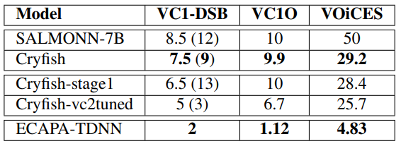
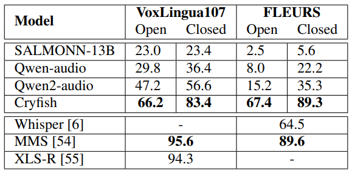

### **Cryfish: Как научить большую языковую модель слышать и понимать звуки?**
В мире искусственного интеллекта господствуют большие языковые модели (LLM, large language models). GPT и ее аналоги прекрасно справляются с написанием текстов, кода и генерацией картинок. Но что насчёт звука? Умение слушать и понимать аудио — это следующий логический шаг на пути к многомодальным системам.

Сегодня мы расскажем вам о **Cryfish** [1] — модели на основе LLM, которая не только читает, но и слышит. Мы разберём, как заставить LLM понимать речь, музыку, эмоции и бытовые шумы, и расскажем о сложностях, с которыми столкнулись при обучении.

#### **Особенности задачи**
Чтобы работать со звуком современные аудиоLLM (**SALMONN** [4], **Qwen2-Audio** [5]) используют специальные энкодеры, которые преобразуют аудио в векторные представления. Часто для этой цели выбирают Whisper, так как это открытая легкая модель, зарекомендовавшая себя в различных речевых задачах. Но модели, обученные с учителем (supervized), в том числе и Whisper, часто страдают от переобучения и не способны обобщать свои возможности на различные аудио-сценарии: эмоциональная речь, шумы, разные условия записи и т.д. 

Наша цель — преодолеть это препятствие и построить модель, которая сможет одинаково уверенно работать с самыми разными аудио-задачами.

#### **Наш подход: Архитектура и данные**

Наша система называется **Cryfish** (Contextual Response Yielding Framework for Intelligent Sound Handling). Она состоит из трех ключевых компонентов:

1.  **Аудио-энкодер:** За восприятие аудио в модели отвечает **WavLM** [2]. Важно держать в голове, что звук это не только слова, произносимые человеком, но и много другое: интонации, неречевые звуки, искажения сигнала и т.д. Чтобы работать в таких разнообразных условиях, supervized-обучения (как у Whisper'a) может быть недостаточно. Здесь нужна более сырая self-supervised модель, и WavLM отлично подходит на эту роль. Как показывает практика, такой формат обучения дает ей более универсальное представление о звуках любого типа.
2.  **Коннектор:** Чтобы «перевести» выход WavLM'а на язык LLM, мы использовали трансформерный коннектор. Он вычисляет два типа представлений на основе аудиопотока: **5 эмбеддингов на уровне всего предложения** (представления глобального контекста) и **последовательность фреймов с частотой 2.5 Гц** (представления, отражающие динамику во времени).
3.  **Языковая модель:** Мы выбрали **Qwen2.5-7B-Instruct** [3]. Получая на вход сконвертированные аудио-эмбеддинги от коннектора и текстовый промпт, модель генерирует итоговый ответ.

> **Архитектура Cryfish.** WavLM преобразует аудио в признаки, коннектор сжимает и адаптирует их для подачи в LLM, а Qwen2 генерирует ответ на основе мультимодального контекста — текстового промпта и аудио-признаков от коннектора.

Теперь поговорим про подготовку **данных** и **обучение** модели. 

Инструкции для обучения аудио-LLM состоят из трех частей: 
* одна или несколько аудиозаписей;
* вопрос на естественном языке;
* ответ на поставленный вопрос.  

Cryfish обучалась в 2 этапа, и для каждого мы подготовили собственные обучающие инструкции.

* **1 этап (шаблонные инструкции)**. Мы взяли 13 тысяч часов аудио (речь, музыка, звуки), и с помощью метаинформации о записях создали шаблонные инструкции под ряд конкретных задач: ASR, распознавание пола, идентификация диктора, распознавание языка, классификация шума, предсказание SNR и расстояния до источника. Под некоторые задачи часть данных пришлось искусственно аугментировать (к примеру, для классификации шума).

На первом этапе, благодаря большому обучающему корпусу шаблонных инструкций (всего 3.2M) модель приобретала базовые навыки аудио-текстовой обработки. Обучались коннектор и языковая модель (последняя — путем LoRa-адаптации). Аудио-энкодер был заморожен всю первую половину обучения. 

* **2 этап (инструкции на естественном языке)**. Чтобы научить модель работать с более разнообразными запросами, нужно было уйти от шаблонных инструкций. Для этого модель с первого этапа генерировала инструкции вида "вопрос-ответ" на естественном языке, опираясь на описания датасетов и теги метаданных (к примеру, вид музыкального инструмента или настроение диктора). Конечно, такой подход не лишен недостатков: вопросы часто получались бинарными, или опирались только на теги, игнорируя аудио (такие примеры пришлось отфильтровать). И тем не менее, генерация с помощью LLM расширяет границы применимости модели, позволяя ей воспринимать не только инструкции определенной структуры, но и более естественные вопросы. 

На втором этапе обучение происходило на 0.6M естественных инструкций и 0.2M шаблонных. Настройки обучения были такими же как на первом этапе. 
#### **Оценка Cryfish: Dynamic SUPERB Phase-2**

Чтобы понять, насколько наша модель хороша, мы протестировали её на новом комплексном бенчмарке **Dynamic SUPERB Phase-2 (DSB)**. Он включает в себя **более 100 задач**, связанных с обработкой речи и других звуков.

Мы сравнили Cryfish с основными открытыми конкурентами: **SALMONN (7B и 13B)**, **Qwen2-Audio** и бейзлайн-моделью **Whisper + LLaMA**. Для оценки использовалась методика LLM-as-a-judje с LLaMA 3.3 70B в качестве судьи. 

**Результаты налицо:**

Чтобы получить комплексную картину по разным задачам, мы ввели относительную оценку (realtive-score-based methodology): приняли показатели бейзлайна (Whisper + LLaMA) по всем задачам за абсолют, и оценили, во сколько раз конкуренты превосходят этот абсолютный уровень. Получилась наглядная картинка, на которой превосходство Cryfish прямо-таки бросается в глаза.

Вот для пущей наглядности еще несколько сравнений. 

По регрессионным задачам (первые 5 строк), средние оценкии accuracy LLM-as-a-judge (Avg LLM-C) в классификационных задачах (6-7 строки), и усредненные rel-scored метрики (8-10 строки).

**Если кратко**

*   **Cryfish показал наивысший совокупный результат** (rel-score-based) — **13.85**, обойдя Qwen2-Audio (8.65) и SALMONN (-1.57 / -2.78).
*   Наша модель лидирует как в **аудиодомене** (звуковые события, музыка) с результатом **22.64**, так и в **речевом** (**51.57** по метрике LLM-as-a-judge).
*   В конкретных задачах, например, в переводе речи с английского на немецкий (SuperbST), Cryfish демонстрирует **BLEU 35.36**, что значительно выше, чем у ближайшего конкурента.

**На этом мы не остановились** и отдельно проверили, насколько реально дообучить модель под две конкретные аудио-задачи.

**1. Верификация диктора (Speaker Verification)**
Здесь мы сравнили Cryfish c разных стадий обучения с SALMONN --- эта аудио-модель специально обучалась на задачу верификации. Мы также дополнительно затюнили Cryfish на базе Voxceleb2 (Cryfish-vc2tuned). Классическим для верификации бейзлайном выступила *ECAPA-TDNN** [6]. 

Наш подход показал **EER 7.5%** против **8.5%** у SALMONN на базе VoxCeleb1. Что важно, в сложных реверберированных условиях (VoICES) Cryfish (**EER 29.2%**) не деградировал до случайного угадывания, в отличие от SALMONN (**EER 50%**). Правда, до ECAPA-TDNN обеим AudioLLM все же ещё далеко.

**2. Идентификация языка (Language Identification)**

Тут Cryfish оказался особенно хорош. Модель уверенно обходит конкурентов как в close, так и в open режимах и даже приближается по метрикам к специализированным моделям. Это доказывает, что наша модель научилась извлекать из аудио достаточно устойчивые признаки, не специфичные для какого-то одного языка.

#### **Выводы и что дальше?**

Cryfish — это убедительное доказательство того, что можно создать универсальную AudioLLM, которая не жертвует широкими возможностями ради узкой специализации.

**Что у нас получилось:**
*   Эффективная архитектура на базе WavLM и Qwen2.
*   Коннектор, который учится выделять из аудио самое главное.
*   Стратегия подготовки данных, сочетающая шаблоны и естественные инструкции.
*   Конкурентные результаты на комплексном бенчмарке и специализированных задачах.

**Над чем ещё предстоит работать:**
*   **Дисбаланс в обучении:** Модель быстро понимает, что на простые классификационные вопросы (да/нет) отвечать «дешевле», чем генерировать длинные тексты. С этим надо бороться на уровне функции потерь.
*   **Промпт-хакинг:** Модель иногда учится угадывать ответ по структуре промпта, а не по содержанию аудио. Требуется тщательный баланс данных.
*   **Отставание от ускоспециализированных моделей:** Пока универсальные AudioLLM не догоняют по точности модели, заточенные под одну задачу (как ECAPA-TDNN для верификации).

В будущем мы планируем экспериментировать с другими энкодерами, улучшать стратегию смешивания модальностей и, конечно, масштабировать обучение.

**Для всех, кто хочет погрузиться в детали:**
Исходный код, модели и подробные результаты выложены в нашем [GitHub репозитории](https://github.com/medbar/cryfish).

Надеемся, эта статья оказалась для вас полезной, и будем рады вашим идеям в комментариях!

### Список литературы

[1] Mitrofanov A. et al. Cryfish: On deep audio analysis with Large Language Models //arXiv preprint arXiv:2508.12666. – 2025.

[2] Chen S. et al. Wavlm: Large-scale self-supervised pre-training for full stack speech processing //IEEE Journal of Selected Topics in Signal Processing. – 2022. – Т. 16. – №. 6. – С. 1505-1518.

[3] Hui B. et al. Qwen2. 5-coder technical report //arXiv preprint arXiv:2409.12186. – 2024.

[4] Tang C. et al. Salmonn: Towards generic hearing abilities for large language models //arXiv preprint arXiv:2310.13289. – 2023.

[5] Chu Y. et al. Qwen2-audio technical report //arXiv preprint arXiv:2407.10759. – 2024.

[6] Desplanques B., Thienpondt J., Demuynck K. Ecapa-tdnn: Emphasized channel attention, propagation and aggregation in tdnn based speaker verification //arXiv preprint arXiv:2005.07143. – 2020.
    

